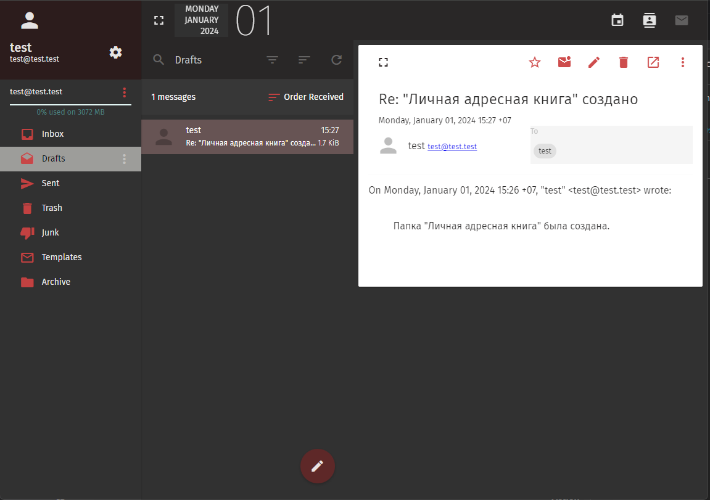
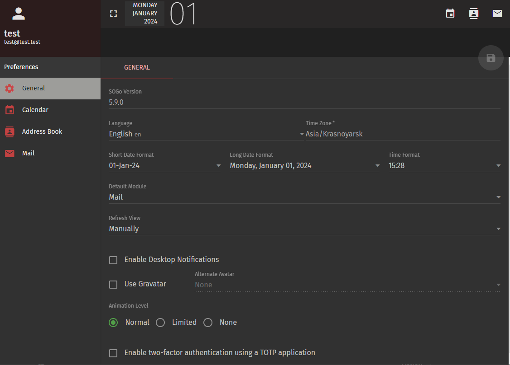
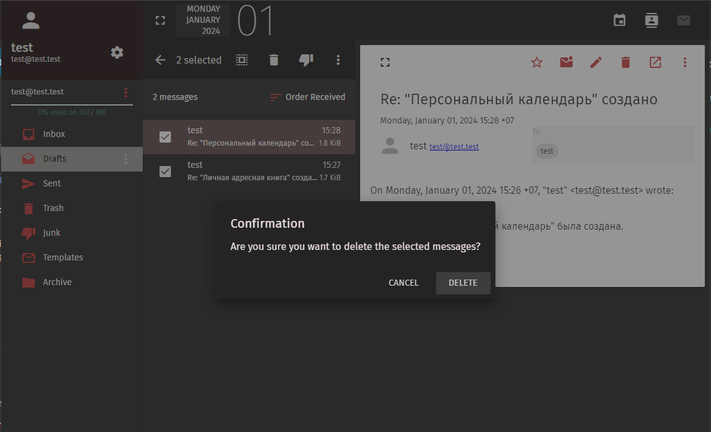
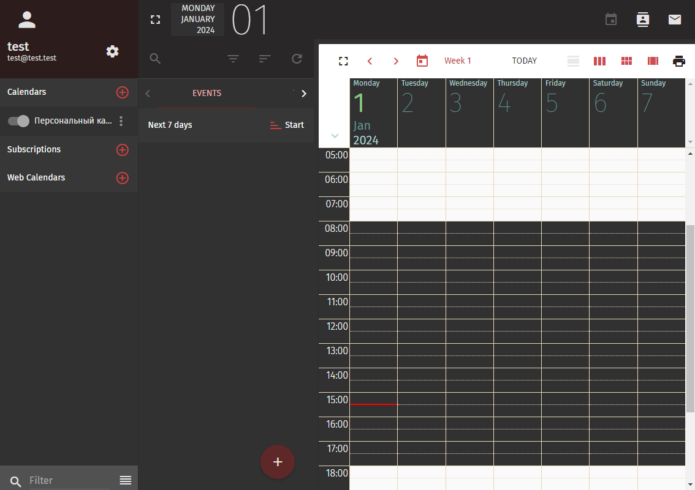
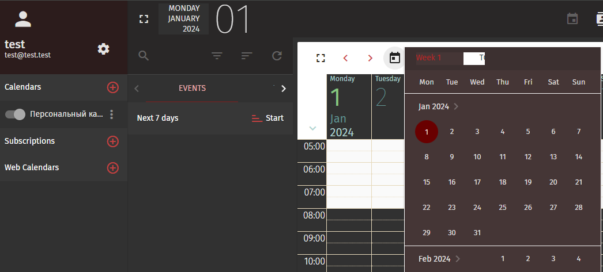

# sogo-dark-red
Dark red theme for SOGo web mail client used in mailcow dockerized

Created by mailcow official documentation - https://docs.mailcow.email/manual-guides/SOGo/u_e-sogo/#apply-custom-sogo-theme

## How to install
``` bash
cd /opt/mailcow-dockerized/data/conf/sogo/
wget https://raw.githubusercontent.com/NlightN22/sogo-dark-red/main/custom-theme.css
cd /opt/mailcow-dockerized/ && docker compose restart memcached-mailcow sogo-mailcow
```
Restart your browser and clear the cache `CTRL+F5`

## Example





